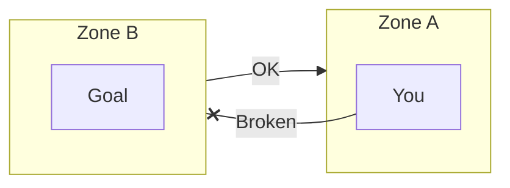
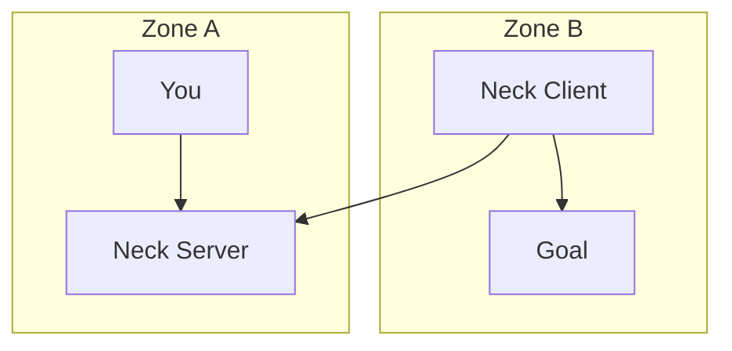
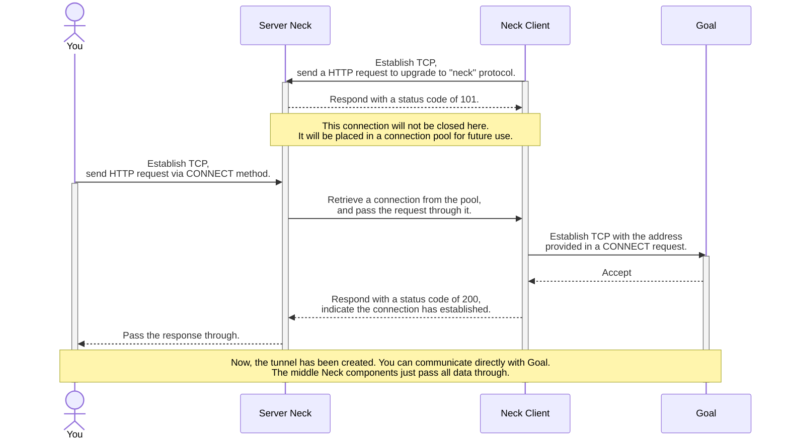
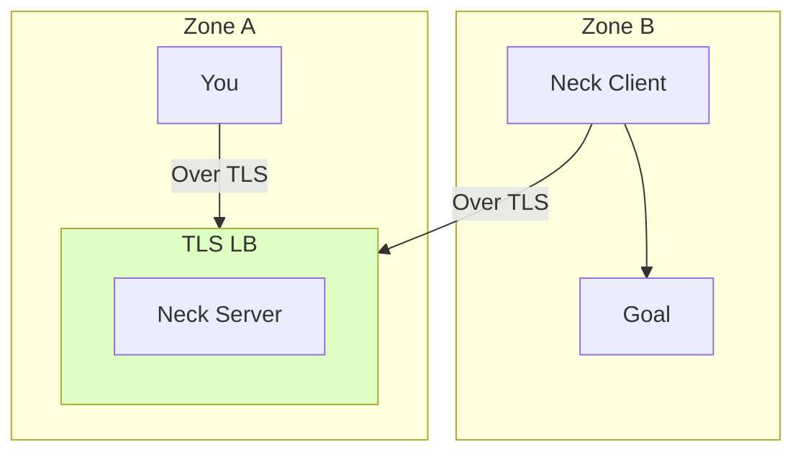

# Neck · [](LICENSE.txt) [](https://github.com/YanagiEiichi/neck/actions/workflows/test.yml)

A specialized HTTP proxy server used to traverse unidirectional network limitations.

Suppose you have two network zones: Zone A and Zone B.
Zone A cannot access Zone B, but Zone B can access Zone A.

Firstly, you need to set up servers in both Zone A and Zone B.
Deploy the Neck server in zone A, and deploy the Neck client in Zone B.

Once this is done, you will be able to access Zone B from Zone A through the Neck server.

## How does the Neck work?

### The Problem

You cannot access Zone B from zone A.



### The Solution of the Neck

Deploy the Neck server in zone A, and deploy the Neck client in Zone B.



### A complete sequence diagram



### For Security

Neck uses HTTP, so it is not secure.
However, you can deploy the Neck Server behind a TLS load balancer to enhance its security.



## Usage

### Server

```text
Start a Neck HTTP proxy server

Usage: neck serve [OPTIONS] [ADDR]

Arguments:
  [ADDR]  Binding the listening address defaults "0.0.0.0:1081"

Options:
      --max-workers <MAX_WORKERS>  The maximum allowed number of workers defaults 200
      --direct                     Proxy directly from the server without creating a worker pool
  -h, --help                       Print help
```

### Client

```text
Create some worker connections and join the pool of the server

Usage: neck join [OPTIONS] <ADDR>

Arguments:
  <ADDR>  Proxy server address

Options:
  -c, --connections <CONNECTIONS>  The number of maximum provided connections defaults 200
  -w, --workers <WORKERS>          The number of concurrent workers defaults 8
      --tls                        Connect proxy server using TLS
      --tls-domain <TLS_DOMAIN>    Specify the domain for TLS, using the hostname of addr by default
  -h, --help                       Print help
```

## Afterwords

> Across the Great Wall we can reach every corner in the world.
